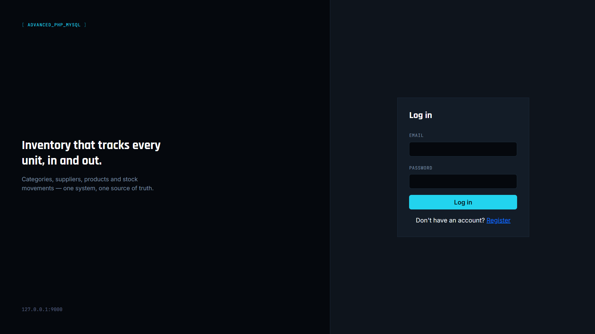
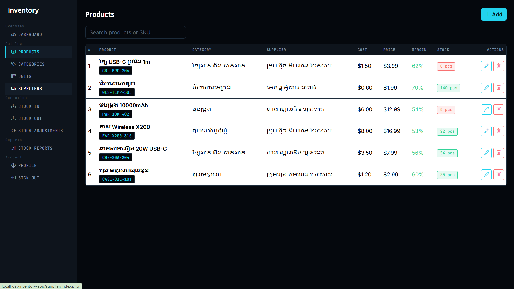
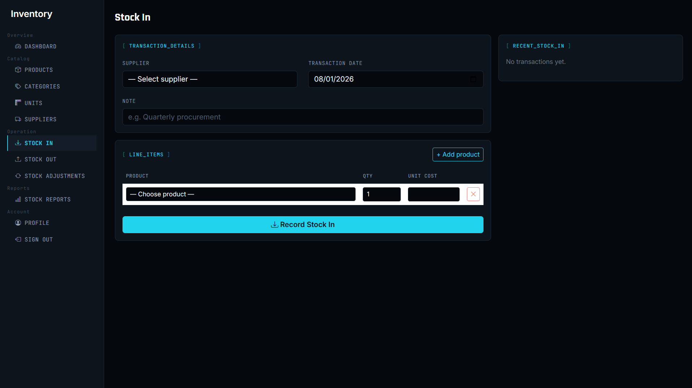
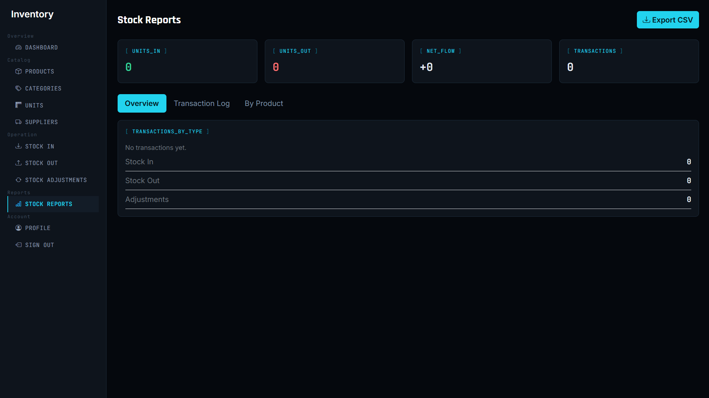
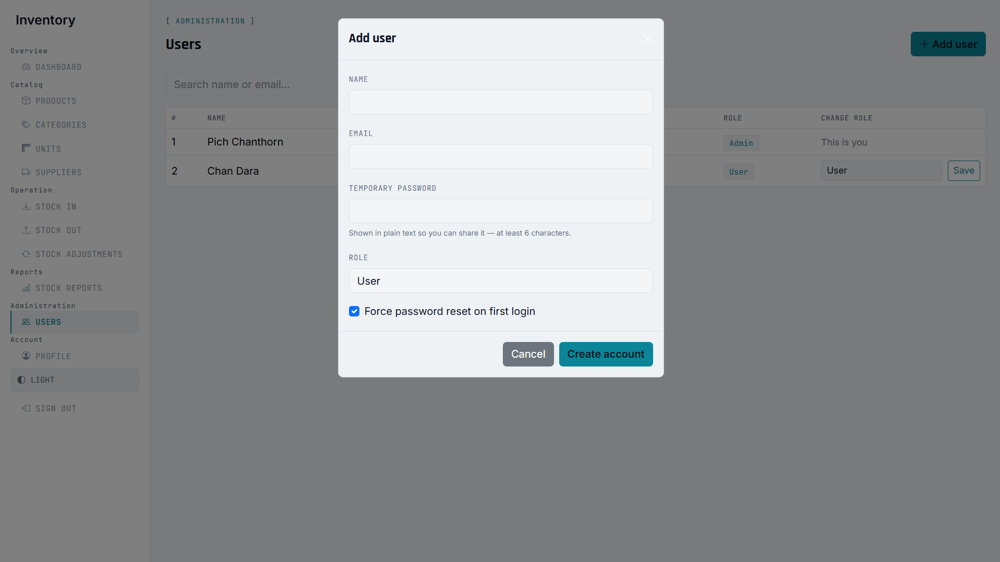

**🌐 Language:** [English](README.md) · ភាសាខ្មែរ

# 📦 ប្រព័ន្ធគ្រប់គ្រងស្តុកទំនិញ (Inventory Management System)

**សាកលវិទ្យាល័យ:** Build Bright University (BBU)
**មុខវិជ្ជា:** Advanced PHP & MySQL
**Stack:** PHP (PDO) · MySQL · Bootstrap 5 · Vanilla JS

ប្រព័ន្ធគ្រប់គ្រងស្តុកទំនិញពេញលេញមួយ សម្រាប់តាមដានផលិតផល អ្នកផ្គត់ផ្គង់
និងចលនាស្តុក — សាងសង់ដោយ PHP និង MySQL សុទ្ធសាធ (គ្មាន framework)
ដោយប្រើ prepared statements គ្រប់ query ដើម្បីការពារ SQL injection។

---

## ✨ មុខងារសំខាន់ៗ

| Module | អ្វីដែលវាធ្វើ |
|---|---|
| **Auth** | ចុះឈ្មោះ, ចូលប្រព័ន្ធ (password បំលែងជា hash), ចាកចេញ, ការគ្រប់គ្រងសិទ្ធិចូលដោយ session |
| **Roles** | Admin / User / Viewer — សកម្មភាព delete លើ Categories, Units, Suppliers និង Products អនុញ្ញាតតែ Admin |
| **User management** | ទំព័រសម្រាប់ Admin បង្កើតគណនីបុគ្គលិក (password បណ្តោះអាសន្ន, ជ្រើស role) និងផ្លាស់ប្តូរ role អ្នកប្រើប្រាស់ណាមួយ |
| **Forced password reset** | គណនីដែល Admin បង្កើតអាចតម្រូវឲ្យប្តូរ password ក្នុងការចូលលើកដំបូង មុននឹងប្រើផ្នែកផ្សេងទៀតរបស់ app |
| **Dashboard** | ចំនួនសរុបផ្ទាល់ខ្លួន: ចំនួនផលិតផល, ចំនួនឯកតាក្នុងស្តុក, តម្លៃស្តុក, ការជូនដំណឹង low-stock |
| **Categories** | CRUD ពេញលេញ ជាមួយមុខងារស្វែងរក |
| **Units** | CRUD ពេញលេញ ជាមួយមុខងារស្វែងរក |
| **Suppliers** | CRUD ពេញលេញ ជាមួយមុខងារស្វែងរក (លេខទូរស័ព្ទ, អ៊ីមែល, អាសយដ្ឋាន) |
| **Products** | CRUD ពេញលេញ — ភ្ជាប់ជាមួយ category/supplier/unit, គណនា margin % ស្វ័យប្រវត្តិ, badge low-stock |
| **Stock In** | Form ទទួលទំនិញច្រើនជួរបន្ទាត់; បន្ថែមស្តុក និងកត់ត្រា transaction ក្នុង DB transaction តែមួយ |
| **Stock Out** | Form ចេញទំនិញច្រើនជួរបន្ទាត់; កាត់ស្តុកជាមួយការត្រួតពិនិត្យចំនួនស្តុកមានគ្រប់គ្រាន់ |
| **Stock Adjustments** | កំណត់ចំនួនស្តុកឲ្យត្រូវនឹងតម្លៃពិត ព្រមជាមួយហេតុផលចាំបាច់ (សម្រាប់ការរាប់ស្តុកជាក់ស្តែង / កែតម្រូវ) |
| **Point of Sale (POS)** | ការគិតលុយបែប cart — បន្ថែមផលិតផល, បញ្ចូលចំនួនប្រាក់ទទួល / ប្រាក់អាប់, កត់ត្រា transaction ប្រភេទ `sale` (មានការការពារស្តុកដូចគ្នានឹង Stock Out), បង្កាន់ដៃអាច print បាន |
| **Stock Reports** | ទិដ្ឋភាពទូទៅ, កំណត់ត្រា transaction ពេញលេញ (filter បាន), កម្រិតស្តុកតាមផលិតផល, Export ជា CSV — រួមបញ្ចូលទាំងការលក់ពី POS ជាមួយ Stock In/Out/Adjustments |
| **Profile** | កែឈ្មោះ/អ៊ីមែល, ប្តូរ password, upload រូបភាព profile, មើល role និងកាលបរិច្ឆេទចូលជាសមាជិក |
| **Theme** | ប្តូររវាង Light/Dark ក្នុង sidebar រក្សាទុកក្នុង browser តាមរយៈ `localStorage` |

---

## 🖼️ រូបភាពគំរូ (Screenshots)

| Login | Dashboard |
|---|---|
|  |  |

| Categories | Products |
|---|---|
|  |  |

| Stock In | Stock Out |
|---|---|
|  |  |

| Stock Reports | Profile (Admin) |
|---|---|
|  |  |

| Profile (Staff) | User Management (Admin) |
|---|---|
|  |  |

---

## 🗄️ រចនាសម្ព័ន្ធ Database

```
roles              (id, name)
users              (id, name, email, password, role_id, avatar,
                     must_change_password, created_at)
categories         (id, name, slug, note, created_at)
units              (id, name, note)
suppliers          (id, name, phone, email, address, note)
products           (id, name, sku, barcode, category_id, supplier_id, unit_id,
                     note, cost_price, sale_price, min_stock, current_stock, created_at)
stock_transactions       (id, reference, type, transaction_date, note, supplier_id, user_id, created_at)
stock_transaction_items  (id, transaction_id, product_id, qty, unit_price, subtotal)
```

`stock_transactions.type` អាចជា `in` / `out` / `adjustment` / `sale` — រាល់ការផ្លាស់ប្តូរស្តុក
(ចូល, ចេញ, កែតម្រូវដោយដៃ ឬការលក់ពី POS) ត្រូវបានកត់ត្រានៅទីនេះទាំងអស់ ដើម្បីមាន audit trail ពេញលេញ។

> **សម្រាប់ការដំឡើងដែលមានស្រាប់៖** ប្រសិនបើ database របស់អ្នកត្រូវបានបង្កើតឡើងមុនពេលដែល
> `database/schema.sql` មាន transaction type `sale` (ដែលត្រូវការសម្រាប់ Point of Sale module)
> សូម run `database/migrations/001_add_sale_transaction_type.sql`ម្តងលើ database នោះ។
> ការដំឡើងថ្មីដោយប្រើ `schema.sql` បច្ចុប្បន្នមានវារួចហើយ។

---

## 📂 រចនាសម្ព័ន្ធ Project

```
inventory-app/
├── auth/                 Login, register, logout
├── category/             Categories CRUD
├── unit/                 Units CRUD
├── supplier/             Suppliers CRUD
├── product/               Products CRUD
├── stock-in/             Stock In form + logic
├── stock-out/            Stock Out form + logic
├── stock-adjustment/     Stock Adjustments form + logic
├── stock-report/         Reports (overview / log / by-product) + CSV export
├── user/                 Admin-only user management (create staff, change roles)
├── includes/             Shared header, footer, auth guard
├── config/                DB connection + base-URL helper
├── database/             schema.sql (tables) + seed.sql (sample data)
├── assets/               style.css (design system)
├── uploads/avatars/      Profile photo uploads
├── profile.php
├── dashboard.php
└── index.php
```

---

## ⚙️ ការដំឡើង & Setup

មានវិធីចំនួន **2** ដើម្បីដំណើរការ project នេះ។ អ្នកគ្រាន់តែជ្រើសរើសយក **មួយ** ប៉ុណ្ណោះ —
មិនចាំបាច់ធ្វើទាំងពីរទេ។ បើមិនប្រាកដថាគួរជ្រើសមួយណា សូមអានប្រអប់ "គួរជ្រើសមួយណា?" ខាងក្រោម។

> **គួរជ្រើសមួយណា?**
> - **មិនធ្លាប់ប្រើ local server ពីមុនមក ចង់បានវិធីសាមញ្ញបំផុត** → ជ្រើសយក
>   **ជម្រើសទី 1 (XAMPP)**
> - **មាន Docker Desktop ដំឡើងស្រាប់ហើយ ឬចង់បាន setup ស្អាតជាមួយ command តែមួយ** →
>   ជ្រើសយក **ជម្រើសទី 2 (Docker)**

---

### 🔹 ជម្រើសទី 1 — ដំណើរការជាមួយ XAMPP (សាមញ្ញបំផុតសម្រាប់អ្នកចាប់ផ្តើម)

ជម្រើសនេះប្រើ **XAMPP** ជា package ឥតគិតថ្លៃមួយ ដែលផ្តល់ Apache (web server),
MySQL (database), និង PHP ក្នុងកញ្ចប់តែមួយ ព្រមជាមួយ control panel សាមញ្ញ —
មិនចាំបាច់ប្រើ command line ទេ។

**ជំហានទី 1 — Download និង install XAMPP**

1. ចូលទៅ [https://www.apachefriends.org](https://www.apachefriends.org) ហើយ
   download កំណែសម្រាប់ operating system របស់អ្នក (Windows/Mac/Linux)។
2. បើក installer ហើយចុច Next រហូតដល់ចប់ (ប្រើ default options ដដែល)។
   ជាធម្មតាវានឹង install ទៅ `C:\xampp` (លើ Windows) — សូមរក្សា path default នេះទុក។
3. បើក **XAMPP Control Panel** ពី Start Menu / Applications folder។
4. ចុច **Start** ត្រង់ជួរ **Apache** និង **MySQL** ទាំងពីរ។ ជួរទាំងពីរគួរប្រែជាពណ៌បៃតង។
   បើជួរណាមួយប្រែជាពណ៌ក្រហមវិញ សូមមើលផ្នែក Troubleshooting ខាងក្រោម។

**ជំហានទី 2 — Download project នេះ**

1. នៅលើទំព័រ GitHub នេះ ចុចប៊ូតុងពណ៌បៃតង **Code** → **Download ZIP**។
2. Extract ZIP file នោះ។ អ្នកនឹងទទួលបាន folder មួយ — ប្តូរឈ្មោះវាទៅ `inventory-app`
   បើវាមិនមែនឈ្មោះនោះរួចហើយ។
3. ផ្លាស់ទី folder `inventory-app` ទាំងមូលនោះទៅក្នុង folder `htdocs` របស់ XAMPP:
   - Windows: `C:\xampp\htdocs\inventory-app`
   - Mac: `/Applications/XAMPP/htdocs/inventory-app`
   - Linux: `/opt/lampp/htdocs/inventory-app`

**ជំហានទី 3 — បង្កើត Database**

1. បើក browser ហើយចូលទៅ `http://localhost/phpmyadmin`។
2. ចុច tab **Import** ខាងលើ។
3. ចុច **Choose File** ហើយជ្រើសរើស `database/schema.sql` ដែលនៅក្នុង folder
   `inventory-app` ដែលអ្នកទើបតែចម្លងចូល។
4. Scroll ចុះក្រោម ហើយចុចប៊ូតុង **Go**។ អ្នកគួរឃើញសារជោគជ័យ — វានឹងបង្កើត
   database ឈ្មោះ `inventory_db` ព្រមទាំង table ទាំងអស់។
5. *(មិនចាំបាច់ក៏បាន ប៉ុន្តែណែនាំ)* ធ្វើដូចគ្នាម្តងទៀតជាមួយ `database/seed.sql`
   ដើម្បីផ្ទុក category, supplier និង product គំរូខ្លះ ដើម្បី app មិនទទេទាំងស្រុងពេលចូលលើកដំបូង។

**ជំហានទី 4 — កែ password Database (ធ្វើតែពេលចាំបាច់)**

XAMPP ភាគច្រើនដែលដំឡើងថ្មីមិនមាន password លើ MySQL user `root` ទេ ដូច្នេះជាធម្មតា
អ្នកអាចរំលងជំហាននេះបាន។ ប៉ុន្តែបើ phpMyAdmin សួរអ្នកឲ្យបញ្ចូល password ពេលចូល
សូមបើក `config/db.php` ដោយ text editor ហើយកែបន្ទាត់នេះ:

```php
$pass    = getenv('DB_PASSWORD') ?: '';   // ដាក់ password MySQL របស់អ្នកចន្លោះសញ្ញា quote
```

**ជំហានទី 5 — បើក App**

1. ចូលទៅ `http://localhost/inventory-app/` ក្នុង browser។
2. ចុច **Register** ហើយបង្កើតគណនីដំបូងរបស់អ្នក។
3. ចូល (Log in) ជាមួយគណនីនោះ ហើយចាប់ផ្តើមប្រើប្រាស់។

> **ចំណាំ:** គណនីដំបូងបំផុតដែលអ្នក register តាមទំព័រ **Register** សាធារណៈ
> គឺជា **User** ធម្មតា មិនមែន **Admin** ទេ។ ដើម្បីដោះសោមុខងារ Admin-only
> (ដូចជាទំព័រ Users) សូមបើក phpMyAdmin ចូលទៅ table `users` រកជួររបស់អ្នក
> ហើយប្តូរ `role_id` ទៅជា `1` (Admin)។

**ការដោះស្រាយបញ្ហា XAMPP**

| បញ្ហា | មូលហេតុ & ដំណោះស្រាយ |
|---|---|
| ជួរ Apache ប្រែជាក្រហម / មិន start | មាន program ផ្សេងក្នុងកុំព្យូទ័រកំពុងប្រើ port 80 ស្រាប់ (ជាទូទៅជា Skype, IIS ឬ web server ផ្សេង)។ បិទ program នោះចោល ឬប្តូរ port របស់ Apache ក្នុង config របស់ XAMPP។ |
| ជួរ MySQL ប្រែជាក្រហម / មិន start | មាន MySQL/MariaDB service ផ្សេងកំពុងរត់ស្រាប់ (ឧ. ពី Laragon ឬ WAMP)។ បញ្ឈប់ service នោះមុន រួចហើយចាប់ផ្តើម MySQL របស់ XAMPP វិញ។ |
| ទំព័របង្ហាញ "Database connection failed" | MySQL មិនកំពុងរត់ — ត្រឡប់ទៅ XAMPP Control Panel ហើយពិនិត្យថាវាបៃតង។ |
| ទំព័រទទេពណ៌ស | បើក XAMPP Control Panel → ជួរ Apache → **Logs** → **PHP error log** ដើម្បីមើលសារ error ពិតប្រាកដ។ |

---

### 🔹 ជម្រើសទី 2 — ដំណើរការជាមួយ Docker (លឿនបំផុត គ្មានចាំបាច់ install XAMPP)

ជម្រើសនេះប្រើ **Docker** ដែលវេចខ្ចប់ web server, PHP និង MySQL ចូលទៅក្នុង
container ដែលរួចរាល់ស្រាប់ ដូច្នេះអ្នកមិនចាំបាច់ install ឬកំណត់រចនាសម្ព័ន្ធវាដោយដៃទេ
— command តែមួយចាប់ផ្តើមអ្វីៗទាំងអស់។

**ជំហានទី 1 — Install Docker Desktop**

1. ចូលទៅ [https://www.docker.com/products/docker-desktop](https://www.docker.com/products/docker-desktop)
   ហើយ download សម្រាប់ operating system របស់អ្នក។
2. Install វា រួចបើក **Docker Desktop** ហើយរង់ចាំរហូតដល់វារត់ (រូប whale icon
   ក្នុង system tray/menu bar គួរនៅស្ងៀម មិនកំពុងបង្វិលទេ)។

**ជំហានទី 2 — Download project នេះ**

1. នៅលើទំព័រ GitHub នេះ ចុចប៊ូតុងពណ៌បៃតង **Code** → **Download ZIP**។
2. Extract ZIP នៅកន្លែងណាក៏បាន (មិនចាំបាច់ដាក់ក្នុង `htdocs` របស់ XAMPP ទេ
   សម្រាប់ជម្រើសនេះ — Docker មិនប្រើ XAMPP ទាល់តែសោះ)។

**ជំហានទី 3 — ចាប់ផ្តើម App**

- **Windows:** បើក folder `inventory-app` ដែល extract រួច ហើយ double-click
  លើ `docker-up.cmd`។ Terminal window ពណ៌ខ្មៅនឹងបើកឡើង ហើយធ្វើអ្វីៗទាំងអស់
  ជូនអ្នក — គ្រាន់តែរង់ចាំវាចប់។
- **Mac / Linux:** បើក terminal ចូលទៅ folder `inventory-app` (`cd`) ហើយ run:
  ```
  docker-compose up -d
  ```

លើកដំបូងដែល run command នេះ Docker ត្រូវ download image ខ្លះ និង setup database
ដូច្នេះអាចចំណាយពេលមួយ ឬពីរនាទី។ រាល់ពេលក្រោយពីនោះ វានឹងចាប់ផ្តើមក្នុងរយៈពេលប៉ុន្មានវិនាទីតែប៉ុណ្ណោះ។

**ជំហានទី 4 — បើក App**

1. ចូលទៅ `http://localhost:9091` ក្នុង browser។
2. ចុច **Register** ហើយបង្កើតគណនីដំបូងរបស់អ្នក។
3. ចូល (Log in) ជាមួយគណនីនោះ ហើយចាប់ផ្តើមប្រើប្រាស់។

> **ចំណាំ:** ដូចគ្នានឹង XAMPP ដែរ គណនីដំបូងដែលអ្នក register គឺជា **User**
> ធម្មតា។ ដើម្បីធ្វើឲ្យខ្លួនអ្នកក្លាយជា Admin អ្នកត្រូវការ MySQL client
> (ដូចជា phpMyAdmin, TablePlus ឬ DBeaver) ភ្ជាប់ទៅ `127.0.0.1:3307`
> (មើលក្នុង `docker-compose.yml`), user `root`, password `1234` — រួចកែ
> `role_id` ទៅជា `1` ក្នុង table `users`។ បើ project របស់អ្នកមាន
> `database/seed.sql` វាអាចមានគណនី Admin រួចរាល់ស្រាប់ — ពិនិត្យ file នោះមុន
> មុននឹងធ្វើវាដោយដៃ។

**ការបញ្ឈប់ / ចាប់ផ្តើមឡើងវិញ Docker**

- ដើម្បីបញ្ឈប់ app: run `docker-compose down` ពី project folder។
- ដើម្បីចាប់ផ្តើមម្តងទៀត: run `docker-compose up -d` (ឬ `docker-up.cmd`
  លើ Windows) ម្តងទៀត — ទិន្នន័យរបស់អ្នកនៅតែរក្សាទុករវាងការ restart។

**ការដោះស្រាយបញ្ហា Docker**

| បញ្ហា | មូលហេតុ & ដំណោះស្រាយ |
|---|---|
| `http://localhost:9091` មិនចូល | Docker Desktop មិនកំពុងរត់ ឬ container មិនទាន់ចាប់ផ្តើមចប់ — ពិនិត្យ status ក្នុង Docker Desktop dashboard ថាមានសញ្ញាក្រហម/error ដែរឬទេ។ |
| Error "Port is already allocated" | មាន program ផ្សេងកំពុងប្រើ port `9091` ឬ `3307` ស្រាប់។ បិទ program នោះចោល ឬកែលេខ port ក្នុង `docker-compose.yml`។ |
| Site បើកបាន ប៉ុន្តែបង្ហាញ database error | MySQL នៅតែកំពុង initialize ពេលអ្នកបើកទំព័រ — រង់ចាំ 20-30 វិនាទីហើយ refresh។ |
| ការកែ `.php` files មិនបង្ហាញលទ្ធផលថ្មី | ត្រូវប្រាកដថាអ្នកកែ file ក្នុង folder ដដែលដែលអ្នក run `docker-compose up -d` ព្រោះ container mount folder នោះដោយផ្ទាល់។ |

---

## 🔒 ចំណុចសុវត្ថិភាព

- Query ទាំងអស់ប្រើ **PDO prepared statements** — គ្មានការភ្ជាប់ string ដោយផ្ទាល់ទេ។
- Password ត្រូវបានបំលែងជា hash ដោយ `password_hash()` / ផ្ទៀងផ្ទាត់ដោយ `password_verify()`។
- រាល់ទំព័រដែលត្រូវការសិទ្ធិចូល ត្រូវពិនិត្យ `$_SESSION['user_id']` តាមរយៈ `includes/auth_check.php`។
- សកម្មភាព delete (Categories, Units, Suppliers, Products) ត្រូវបានការពារ
  server-side តាម role មិនមែនគ្រាន់តែលាក់ប៊ូតុងក្នុង UI ទេ — មាន `isAdmin()`
  check រត់មុននឹង delete query ជានិច្ច ដូច្នេះអ្នកមិនមែន admin មិនអាច delete
  បានទោះបីទាយ URL ក៏ដោយ។
- គណនីបុគ្គលិកថ្មីត្រូវបានបង្កើតតែដោយ Admin (តាមទំព័រ Users) ជាមួយ password
  បណ្តោះអាសន្នដែលបំលែងជា hash; ការចុះឈ្មោះសាធារណៈដោយខ្លួនឯង
  (`auth/register.php`) នៅតែបើកចំហនៅឡើយ ប៉ុន្តែគួរដាក់កម្រិតនៅពេលដែល
  គណនីបង្កើតដោយ Admin ត្រូវបានប្រើប្រាស់ជាផ្លូវការ។
- រូបភាព profile ដែល upload ត្រូវបានផ្ទៀងផ្ទាត់ប្រភេទ file (MIME) និងទំហំ
  មុននឹងរក្សាទុក។

---

## 👤 អ្នកសរសេរ

សាងសង់ដោយ **[Pich Chan Thorn]** — BBU, ឆ្នាំទី 3 ឆមាសទី 1, Advanced PHP & MySQL។
ថ្នាក់: **ច័ន្ទ (Monday)**
