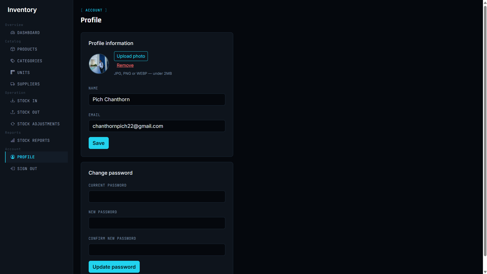

# 📦 Inventory Management System

**Course:** Advanced PHP & MySQL
**Stack:** PHP (PDO) · MySQL · Bootstrap 5 · Vanilla JS

A full-stack inventory management system for tracking products, suppliers,
and stock movements — built with plain PHP and MySQL (no framework), using
prepared statements throughout for SQL-injection safety.

---

## ✨ Features

| Module | What it does |
|---|---|
| **Auth** | Register, login (hashed passwords), logout, session-based access control |
| **Dashboard** | Live totals: products, units in stock, inventory value, low-stock alerts |
| **Categories** | Full CRUD with search |
| **Units** | Full CRUD with search |
| **Suppliers** | Full CRUD with search (phone, email, address) |
| **Products** | Full CRUD — linked to category/supplier/unit, auto-calculated margin %, low-stock badge |
| **Stock In** | Multi-line receiving form; increases stock and logs a transaction inside a DB transaction |
| **Stock Out** | Multi-line issuing form; decreases stock with an availability check |
| **Stock Adjustments** | Sets an exact stock count with a required reason (for physical counts / corrections) |
| **Stock Reports** | Overview, full transaction log (filterable), by-product stock levels, CSV export |
| **Profile** | Update name/email, change password, upload a profile photo |

---

## 🖼️ Screenshots

| Login | Dashboard |
|---|---|
|  |  |

| Categories | Products |
|---|---|
|  |  |

| Stock In | Stock Out |
|---|---|
|  |  |

| Stock Reports | Profile |
|---|---|
|  |  |

---

## 🗄️ Database Schema

```
roles              (id, name)
users              (id, name, email, password, role_id, avatar, created_at)
categories         (id, name, slug, note, created_at)
units              (id, name, note)
suppliers          (id, name, phone, email, address, note)
products           (id, name, sku, barcode, category_id, supplier_id, unit_id,
                     note, cost_price, sale_price, min_stock, current_stock, created_at)
stock_transactions       (id, reference, type, transaction_date, note, supplier_id, user_id, created_at)
stock_transaction_items  (id, transaction_id, product_id, qty, unit_price, subtotal)
```

`stock_transactions.type` is one of `in` / `out` / `adjustment` — every stock
change (in, out, or manual correction) is logged here for a full audit trail.

---

## 📂 Project Structure

```
inventory-app/
├── auth/                 Login, register, logout
├── category/             Categories CRUD
├── unit/                 Units CRUD
├── supplier/             Suppliers CRUD
├── product/               Products CRUD
├── stock-in/             Stock In form + logic
├── stock-out/            Stock Out form + logic
├── stock-adjustment/     Stock Adjustments form + logic
├── stock-report/         Reports (overview / log / by-product) + CSV export
├── includes/             Shared header, footer, auth guard
├── config/                DB connection + base-URL helper
├── database/             schema.sql (tables) + seed.sql (sample data)
├── assets/               style.css (design system)
├── uploads/avatars/      Profile photo uploads
├── screenshots/          README screenshots
├── profile.php
├── dashboard.php
└── index.php
```

---

## ⚙️ Setup & Installation

1. Install **XAMPP** (or a similar Apache + MySQL + PHP stack) and start
   **Apache** and **MySQL**.
2. Copy the `inventory-app` folder into `C:\xampp\htdocs\`.
3. Open `http://localhost/phpmyadmin` → **Import** → select
   `database/schema.sql` → **Go**. This creates the `inventory_db` database
   and all tables.
4. *(Optional)* Import `database/seed.sql` the same way to load sample data.
5. If your MySQL root user has a password, edit `config/db.php` and set `$pass`.
6. Visit `http://localhost/inventory-app/` → **Register** an account → **Log in**.

---

## 🔒 Security notes

- All queries use **PDO prepared statements** — no raw string concatenation.
- Passwords are hashed with `password_hash()` / verified with `password_verify()`.
- Every protected page checks `$_SESSION['user_id']` via `includes/auth_check.php`.
- Uploaded profile photos are validated by MIME type and size before saving.

---

## 👤 Author

Built by **[Pich Chan Thorn]** — BBU, Year 3 Semester 1, Advanced PHP & MySQL.
